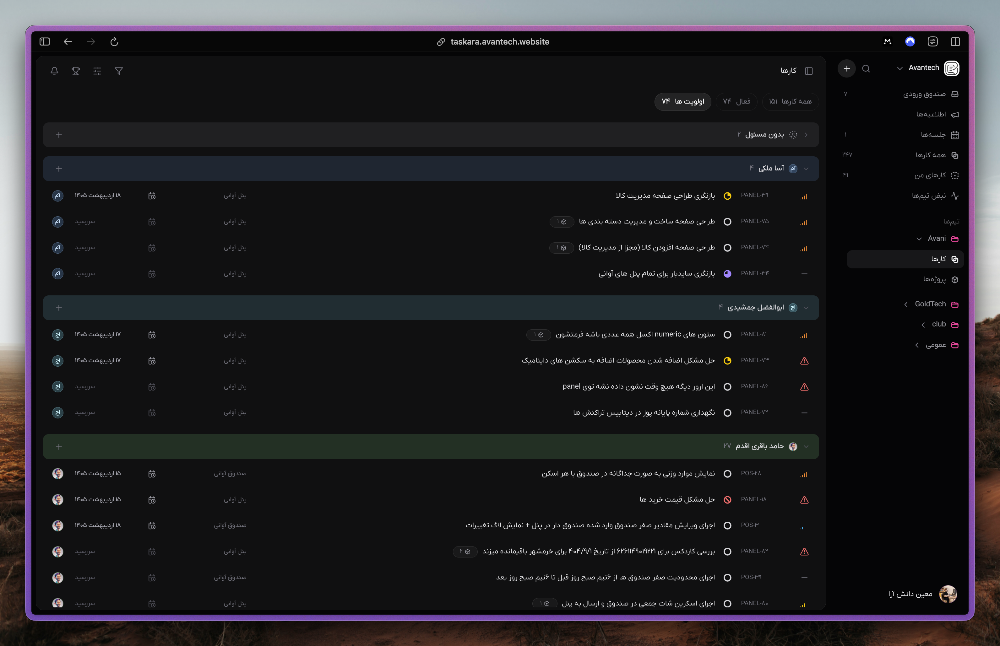

# Taskara

Agentic team task manager optimized for Mattermost and Codex workflows, backed by PostgreSQL and Prisma. The UI is RTL-first, Jalali date-time aware, and shaped around a Linear-like task experience.



## Highlights

- Linear-like workflow states: backlog, todo, in progress, review, blocked, done, canceled
- Jalali timer/date-time support for due scheduling (example: `1405/02/04 14:30`)
- RTL-first Persian UI with workspace/project/task hierarchy
- Mattermost slash-command integration for task creation and updates
- Native Codex plugin for MCP-based task operations and agent workflows

## Stack

- Runtime/package manager: Bun
- API: Fastify + TypeScript
- Database: PostgreSQL + Prisma
- Web: Vite + React (Circle-based UI, adapted for RTL/Jalali)
- Integrations: Mattermost slash commands/API, repo-local Codex plugin
- Agent workflows: auditable proposals and daily planning endpoints

## Quick Start

```bash
cp .env.example .env
bun install
docker compose up -d postgres redis
bun run db:generate
bun run db:migrate
bun run dev
```

API: the `TASKARA_API_URL` value from `.env.example`

Web: the Vite dev server URL printed by `bun run dev:web`

The web UI runs on Vite and talks directly to the API using:

```txt
VITE_TASKARA_API_URL=<api-url>
```

Create the first account and workspace through `/signup` and `/onboarding`. Workspace routing in the browser is slug-based, e.g. `/<workspace-slug>/projects`.

## Docker / Coolify Deployment

The repo includes production Dockerfiles for the API and web UI:

```txt
Dockerfile.api
Dockerfile.web
docker-compose.coolify.yml
```

Recommended Coolify setup for one Compose application:

1. Create a Docker Compose resource from the repository root.
2. Use `docker-compose.coolify.yml` as the compose file.
3. Let Coolify generate the service URLs and Postgres password from:

```txt
SERVICE_URL_WEB
SERVICE_URL_API
SERVICE_PASSWORD_POSTGRES
```

The API and web UI both listen on internal container port `80` in the Coolify compose deployment, so Coolify can generate clean public URLs without `:4000` or `:80`. The compose file wires `WEB_ORIGIN` to the generated web URL and writes `TASKARA_API_URL` into the web container at startup, so the same web image can be reused across environments.

You can also deploy them as two separate Dockerfile resources:

```txt
API Dockerfile: Dockerfile.api, port 80
Web Dockerfile: Dockerfile.web, port 80
```

For the API resource, set:

```txt
DATABASE_URL=postgresql://...
WEB_ORIGIN=https://your-web-domain.example
API_HOST=0.0.0.0
API_PORT=80
TASKARA_RUN_MIGRATIONS=true
```

For the web resource, set:

```txt
TASKARA_API_URL=https://your-api-domain.example
```

`Dockerfile.api` generates the Prisma client during build and runs `prisma migrate deploy` on startup by default. Set `TASKARA_RUN_MIGRATIONS=false` if migrations are handled elsewhere.

## Core API

```txt
GET  /health
GET  /me
GET  /users
POST /users
PATCH /users/:id
PATCH /users/:id/role
DELETE /users/:id/membership
GET  /projects
POST /projects
GET  /tasks
POST /tasks
GET  /tasks/:idOrKey
PATCH /tasks/:idOrKey
POST /tasks/:idOrKey/comments
POST /integrations/mattermost/command
POST /agent/thread-to-tasks
POST /agent/daily-plan
POST /agent/actions/:id/apply
```

## Web UI

The frontend now uses the Circle interface shell as the base UI and is wired to the implemented Taskara APIs:

- `/{workspace}/team/all/all`: task board
- `/{workspace}/projects`: projects and subprojects
- `/{workspace}/members`: workspace members
- `/{workspace}/teams`: teams
- `/{workspace}/settings`: admin user management
- `/{workspace}/inbox`: notifications and activity

UI details:

- RTL layout by default
- Sidebar anchored on the right
- Jalali date display everywhere
- Jalali due-date input for task creation, format: `1405/02/04 14:30`

Authenticated API requests use a session bearer token plus an explicit workspace slug:

```txt
authorization: Bearer <session-token>
x-workspace-slug: <workspace-slug>
```

Create users and workspaces through signup, onboarding, invitations, or admin screens. User-management endpoints require `OWNER` or `ADMIN`.

Create a user:

```bash
curl -X POST "$TASKARA_API_URL/users" \
  -H "content-type: application/json" \
  -H "authorization: Bearer <session-token>" \
  -H "x-workspace-slug: <workspace-slug>" \
  -d '{"email":"sara@example.com","name":"Sara","role":"MEMBER","mattermostUsername":"sara"}'
```

Change a workspace role:

```bash
curl -X PATCH "$TASKARA_API_URL/users/<user-id>/role" \
  -H "content-type: application/json" \
  -H "authorization: Bearer <session-token>" \
  -H "x-workspace-slug: <workspace-slug>" \
  -d '{"role":"ADMIN"}'
```

## Mattermost Slash Command

Create a slash command in Mattermost that posts to:

```txt
<TASKARA_API_URL>/integrations/mattermost/command
```

Set the slash token in `.env`:

```txt
MATTERMOST_SLASH_TOKEN="your-slash-token"
MATTERMOST_SYNTHETIC_EMAIL_DOMAIN="mattermost.example.invalid"
```

Taskara resolves the workspace from `MATTERMOST_WORKSPACE_SLUG` when set, otherwise from Mattermost `team_domain`/`team_id`. The workspace must already exist through onboarding.

Commands:

```txt
/task create Fix checkout bug
/task list mine
/task status CORE-123 in-review
/task assign CORE-123 @sara
/task due CORE-123 فردا
/task bind CORE
```

## Codex Plugin

Repo-local plugin scaffold:

```txt
plugins/taskara-agent
```

Use the helper script:

```bash
cd plugins/taskara-agent
TASKARA_API_URL="<api-url>" TASKARA_USER_EMAIL="<user-email>" TASKARA_WORKSPACE_SLUG="<workspace-slug>" bun scripts/taskara.mjs list-my-tasks
TASKARA_API_URL="<api-url>" TASKARA_USER_EMAIL="<user-email>" TASKARA_WORKSPACE_SLUG="<workspace-slug>" bun scripts/taskara.mjs search-tasks --query "blocked"
TASKARA_API_URL="<api-url>" TASKARA_USER_EMAIL="<user-email>" TASKARA_WORKSPACE_SLUG="<workspace-slug>" bun scripts/taskara.mjs create-task --project-id "<uuid>" --title "Implement audit trail"
```

## Data Model Highlights

- Workspaces, teams, projects, subprojects
- Linear-style task workflow: backlog, todo, in progress, review, blocked, done, canceled
- Human-readable task keys, e.g. `CORE-123`
- Comments, labels, dependencies, activity logs, notifications
- Mattermost channel-to-project bindings
- Agent runs and proposed actions with explicit apply step

## Implementation Notes

- All timestamps are stored in UTC.
- The UI formats and accepts dates in Jalali; the API still stores UTC timestamps.
- Agent endpoints persist inputs, outputs, and proposed actions.
- Bulk/destructive agent work should stay proposal-based until explicitly applied.

## Native Codex Tools

The repo includes a native MCP-backed Codex plugin at:

```txt
plugins/taskara-agent
```

The repo-local marketplace entry is:

```txt
.agents/plugins/marketplace.json
```

The plugin MCP config is:

```txt
plugins/taskara-agent/.mcp.json
```

Configure the plugin with an existing onboarded workspace and member:

```txt
TASKARA_API_URL=<api-url>
TASKARA_USER_EMAIL=<user-email>
TASKARA_WORKSPACE_SLUG=<workspace-slug>
```

After restarting Codex, install/enable `Taskara Agent` from the local marketplace. The plugin exposes native tools such as `create_task`, `search_tasks`, `update_task`, `comment_on_task`, `generate_daily_plan`, `triage_backlog`, `generate_weekly_report`, `create_user`, and `update_user_role`.

Smoke-test MCP discovery without Codex:

```bash
bun -e 'import { Client } from "@modelcontextprotocol/sdk/client/index.js"; import { StdioClientTransport } from "@modelcontextprotocol/sdk/client/stdio.js"; const t = new StdioClientTransport({ command: "bun", args: ["scripts/mcp-server.ts"], cwd: "plugins/taskara-agent", env: { TASKARA_API_URL: process.env.TASKARA_API_URL, TASKARA_USER_EMAIL: process.env.TASKARA_USER_EMAIL, TASKARA_WORKSPACE_SLUG: process.env.TASKARA_WORKSPACE_SLUG } }); const c = new Client({ name: "smoke", version: "0.1.0" }, { capabilities: {} }); await c.connect(t); console.log((await c.listTools()).tools.map((tool) => tool.name)); await c.close();'
```
